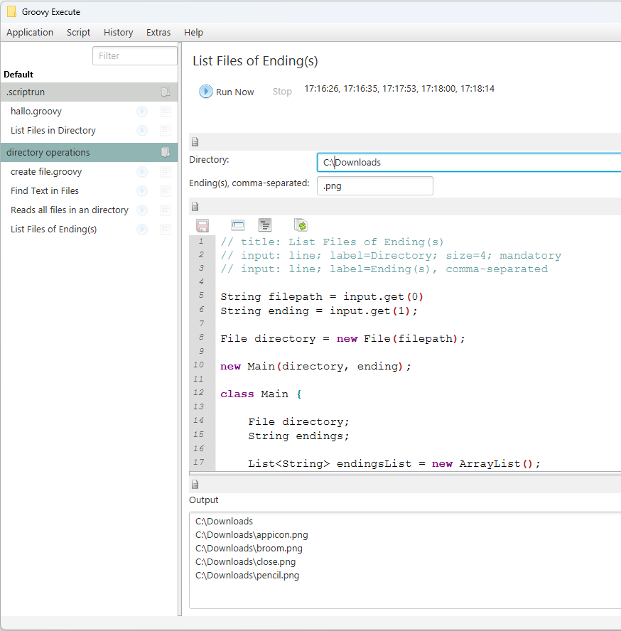
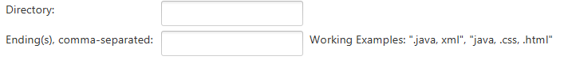

# ScriptRun

Interface to easily run scripts (currently: Groovy only)

## Features

* **Adding difference directories** containing .groovy and .java scripts
* **Run scripts**
  * With custom input fields (defined with comments in the script)
  * Get output (Text, HTML)
* **Script Editor** with syntax highlighting



## Current Release

Download: [ScriptRun 0.91](Releases/0.91/ScriptRun.exe)

## More Documentation, with Details

* [Input Fields](docs/script_input_fields.md)
* [Script Output](docs/script_output.md)

## Quick Start: Input Fields

[--> Documentation: Input Fields](docs/script_input_fields.md)

ScriptRun supports defining
* Script Title, Description
* Input fields (Textfield, Textarea, Radio Button Choice)

Example:

```
// Please add these comments AT THE BEGINNING of the file to work
// title: List Files in Directory
// description: Listing any files found in the directory specified
// input: type=line; label=Directory; size=3; mandatory
// input: type=line; label=Ending(s), comma-separated; description=Working Examples: ".java, xml", "java, .css, .html"
```

This will show these input fields for executing the script:



### Read Field Input

To read field input in the scripts use:

```
String firstFieldText = INPUT.get(0);
String secondFieldText = INPUT.get(1);
...
```

## Quick Start: Script Output

[--> Documentation: Script Output](docs/script_output.md)

Inside the scripts you can write some output to be shown in the ScriptRun interface:

* Text-Output, using
  * `System.out.print()` or
  * `System.out.println()`
* HTML-Output, using
  * `OUTPUT.setHead("")` sets content in `<head></head>` 
  * `OUTPUT.addHtml("")` adds content to `<body></body>`

## Version History

## Version 0.92 (ongoing)
(NOT YET CREATED)

* Read metadata for file only from file content (not registry); might be re-activated in the future

## Version 0.91
(2022-11-20)

* Fix display of recent execution parameters
* Ability to remove certain recent execution entries

Technical changes

* Adding library `MigLayout`

## Version 0.9
(2022-11-16)

First version of the software **ScriptRun**