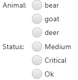

[<< Back](../README.md)

# Script Input Fields

ScriptRun supports defining
* Script Title, Description
* Input fields (Textfield, Textarea, Radio Button Choice)

Example:

```
// Please add these comments AT THE BEGINNING of the file to work
// title: List Files in Directory
// description: Listing any files found in the directory specified
// input: type=line; label=Directory; size=3; mandatory
// input: type=line; label=Ending(s), comma-separated; description=Working Examples: ".java, xml", "java, .css, .html"
```

Field types:

## Text Field: `line`

Set `type=line` to get a input field (single line):

```
// input: type=line; label=Directory; size=3; mandatory
```

(size: 3-5)

## Text Field: `text`

Set `type=text` to get a multi-line field:

```
// input: type=text; label=Directory; size=5; mandatory
```

(size: 3-5)

## Choice: `select`

Set `type=select` and add multiple items to get a selection:

```
// input: type=select; label=Animal; item=bear; item=goat; item=deer
// input: type=select; label=Status; item=orange,Medium; item=red,Critical; item=green,Ok; mandatory
```



* Separated by comma (`,`) a label for the items can be added.

## Get Input

For accessing text input for the input fields defined, use these **static** fields:

* INPUT.get(index)

Examples:

```
String firstFieldText = INPUT.get(0);
String secondFieldText = INPUT.get(1);
```